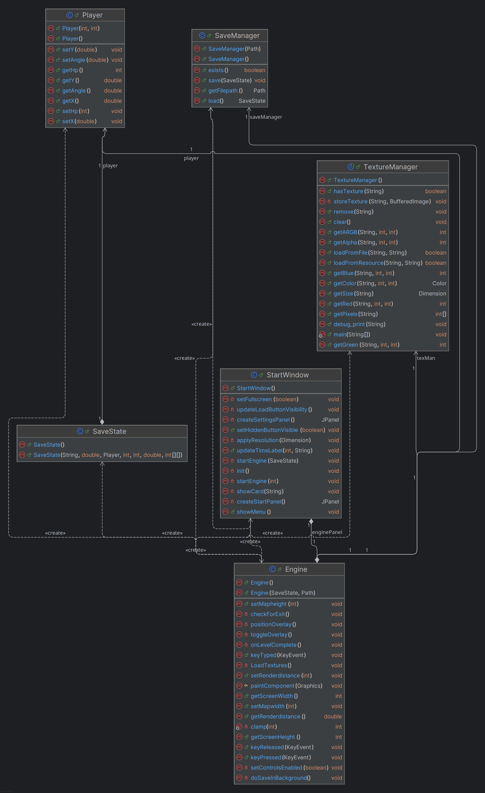

# Escape from Labyrinth – raycasting engine in Java

A first-person maze game with its own software raycasting engine, written in Java with Swing and no external graphics libraries. Made as a university assignment. The goal is to find the exit of the labyrinth before the 5-minute timer runs out; the remaining time is saved for each map and shown in the map selection.

> **Status:** playable demo. One map is built in; the other two map slots are placeholders.



## How the renderer works

Everything is drawn pixel by pixel into the `int[]` buffer behind a `BufferedImage`, which is then copied to the screen in one step.

- **Raycasting:** one ray per screen column across a 60° field of view. Each ray is traced through the tile grid with two DDA passes, one checking horizontal and one vertical grid-line intersections, and the closer wall hit is used.
- **Fisheye correction:** the hit distance is multiplied by the cosine of the angle between the ray and the view direction, so walls stay straight.
- **Textured walls:** the texture column is chosen from where the ray hits the wall, and rows are sampled along the wall height (with correct clipping when a wall is taller than the screen). If the texture cannot be loaded, the walls are drawn with plain shading instead.
- **Distance fog** on the walls, floor and ceiling, with a configurable render distance.

## Features

- Main menu, map selection with the saved time for each map, and a settings screen (resolution, fullscreen), built with `CardLayout`
- Collision detection against the tile map
- Save and load: the game state is serialised on a background thread (`SwingWorker`), and saves are written atomically (to a temporary file first, then moved into place), so a crash cannot leave a half-written save
- JUnit 5 tests for the engine, the player and the texture manager, and Javadoc on the classes

## Controls

| Key | Action |
|---|---|
| ↑ / ↓ | Move forward / backward |
| ← / → | Turn |
| Esc | Pause and show the save button |

## Tech stack

Java 21 · Swing / AWT · JUnit 5 · Maven

## Running

Requirements: JDK 21 and Maven. Run from the project root, because the textures and map folders are loaded with relative paths:

```
mvn compile
java -cp target/classes StartWindow
```

Run the tests with `mvn test`.

## Project structure

```
src/main/java/
├── StartWindow.java     window, menus, map selection, settings
├── Engine.java          raycaster, input, timer, saving
├── TextureManager.java  texture loading and pixel access
├── Player.java          player state
├── SaveState.java       serialisable game state
└── SaveManager.java     atomic save and load
```
